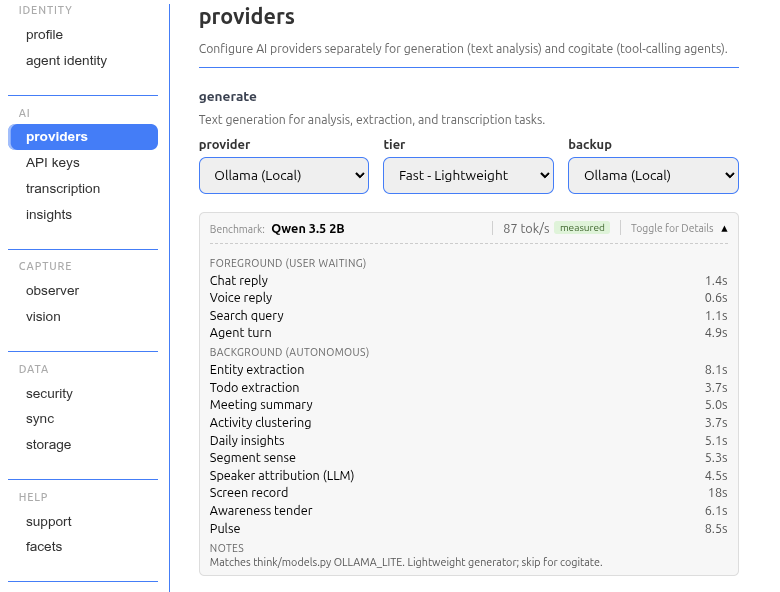
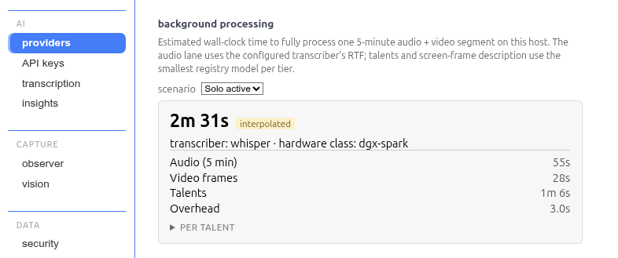
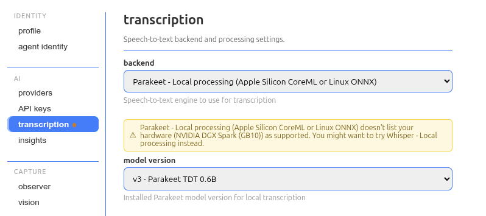

# Fork Divergence

This document catalogs how this fork (`parkerhdavis/Solstone`) currently diverges from upstream (`solpbc/solstone-journal`, formerly `solpbc/solstone`). It is a **map of the live divergence surface**, not a running changelog — when a fork change lands upstream or is removed, it drops out of the sections below into [Historical context](#historical-context) rather than accreting.

The fork is a dev/testing instance running on a DGX Spark (GB10, aarch64 Linux). As of the 0.6.9 merge (2026-06-19), divergence clusters around two things upstream doesn't carry:

1. A **local-model benchmarking** feature that estimates inference speed/feasibility per host *before* weights are pulled.
2. The **vision-capable served-model choice** — the fork points the bundled `local` provider's single fixed model at a heavier VLM than upstream's default.

The fork's former largest divergence — a self-hosted aarch64-Linux **CUDA** llama-server build for the Spark — **converged in the 0.5.4 merge**: upstream now ships its own aarch64-Linux GPU build (Vulkan) and a Vulkan-only launch path, so the fork dropped the CUDA build and rides upstream's binary on the bundled path. A clean same-model/same-quant benchmark on the GB10 (2026-06-16) has since measured that CUDA binary at **~34% faster generation / ~38% faster prompt** than the Vulkan bundle, so it's **retained — but as a deployment artifact, not code divergence**: it runs as a standalone server behind upstream's new BYO-endpoint override (0.6.x), entirely outside the shared provider code. See [Historical context](#historical-context). Everything else is small. For the capability/routing view of providers, see [PROVIDER_MATRIX.md](PROVIDER_MATRIX.md).

## ⏱️ Local-model benchmarking & hardware probe

The fork's largest divergence, and a feature upstream has no equivalent for: a speed/feasibility heuristic that tells you what a local model will do on *this* host before you download it, plus a per-segment background-processing estimate. As of the 0.6.4 merge it's a **CLI + JSON-API surface with no settings UI** — the settings-tab cards converged away (see the JSON-API bullet below and [Historical context](#historical-context)).

**Files:** `solstone/apps/benchmark/` (the standalone Convey app — `call.py` `sol call benchmark` sub-app, `routes.py` JSON API at `/api/{models,scenarios,segment}`, `app.json` nav entry; **no `workspace.html` yet**), `solstone/think/benchmark/` (estimator `estimate.py`, connect-only `harness.py`, the fork-only maintainer-only standalone head-to-head `standalone.py`, fixtures, and the `models.json` / `reference.json` / `segment.json` / `tasks.json` / `transcribers.json` registries), `solstone/think/hardware.py` (host probe; owns `journal/health/hardware.json`), `solstone/think/providers/__init__.py` (`list_installed_local_models()`), `solstone/apps/settings/routes.py` (`_fresh_hardware` + the `/api/transcribe` hardware enrichment — the benchmark `/api/*` endpoints now live in the benchmark app, not settings), and tests `tests/test_benchmark_estimate.py`, `tests/test_benchmark_segment.py`, `tests/test_hardware.py`, `tests/test_benchmark_routes.py`, `solstone/apps/benchmark/tests/test_call.py`.

- **Per-model tok/s estimate.** `solstone/think/hardware.py` probes CPU / RAM / NVIDIA GPUs and caches the result. The estimator reads `reference.json` (measured tok/s per canonical hardware class) and `models.json` (pre-vetted local models with measured numbers); when the host's exact class isn't measured it interpolates by `fp16_tflops × mem_bandwidth` and reports `confidence="interpolated"`. Direct wall-clock measurements were taken on the DGX Spark.
- **Per-segment background estimate.** Layered on the tok/s heuristic: the wall-clock seconds to fully process one 5-minute segment, decomposed into **Audio** (STT real-time-factor), **Video** (frame describe), **Talents** (per-segment LLM talents), plus a fixed overhead. Scenarios (`solo_active`, `meeting_active`, `idle`) live in `segment.json`.
- **Transcriber RTF surface.** STT cost is real-time-factor, not tok/s, so `transcribers.json` declares each backend's `supported_hardware` / `fallback` / `benchmarkable` axes and the harness has a `--transcriber` mode. Whisper's measured RTF on the Spark is 0.182 (`medium.en` / CUDA / float16).
- **CLI** (`sol call benchmark`): `profile`, `list-models`, `estimate`, `segment`, `scenarios`, `tasks`.
- **JSON API (no UI yet).** The standalone `benchmark` app exposes `/api/models`, `/api/scenarios`, and `/api/segment`; the routes re-probe hardware on each request via `_fresh_hardware`, so a transient `nvidia-smi` failure (driver warmup at boot, container-startup contention) can't poison the cache. It carries an `app.json` nav entry (📊 Benchmark) but **ships no `workspace.html`** — `routes.py` notes a benchmark workspace "can be layered on later." The rich settings-tab cards shown in earlier revisions of this doc (per-model tok/s + a "Background processing" lane breakdown) were **removed** when `solstone/apps/settings/workspace.html` converged to upstream in the 0.6.4 merge; the screenshots now live in [Historical context](#historical-context). (The benchmark `call.py` also reads `solstone.think.benchmark` + the hardware probe directly rather than over HTTP, so it carries a fork-only `scripts/check_call_http_only.py` allowlist entry — to ratchet to zero once it's converted to the `/app/benchmark/api/*` endpoints.)

## 🔧 Vision-capable local served model

Upstream ships a bundled `local` (llama-server, GGUF over an OpenAI endpoint) provider as a **single fixed model behind a supervisor-owned, always-on daemon** with a connect-only client (upstream commit `22034e83`), with the vision rails built in — `image_url` content translation in `local.py`, mmproj threading through `local_install`, and a `--mmproj` launch flag in the supervisor. Upstream's fixed model is a smaller `qwen3.5-4b` VLM. The fork keeps that exact architecture and changes only the **one fixed model**, pointing it at a heavier same-family VLM so the rails carry a stronger model.

**Files:** `solstone/think/models.py` (`LOCAL_MODEL` → Qwen3.6-35B-A3B), `solstone/think/providers/local.py` (Qwen3.6-35B-A3B `LOCAL_MODEL_SPECS` entry + the `bench_ensure_installed` / `bench_run_once` benchmark interface), `solstone/apps/thinking/local_bootstrap.py` (the served-model display label — the bootstrap moved from the settings app to the thinking app upstream), and tests `tests/test_local.py`, `solstone/apps/thinking/tests/test_local_bootstrap_routes.py`. (`local_install.py` and `supervisor.py` are now byte-identical to upstream — see [Historical context](#historical-context).)

- **Vision-capable single model.** `LOCAL_MODEL = "local/qwen3.6-35b-a3b"` (Q8_0 + `mmproj-BF16`), a 35B-A3B MoE VLM (~3B active), replacing upstream's smaller `qwen3.5-4b` VLM default. Everything downstream is upstream machinery, unchanged: `local_install` downloads + sha256-verifies the projector GGUF alongside the weights, the supervisor passes `--mmproj` at launch because the spec carries one, and `local.py` translates `image_url` image content. The one always-on local daemon therefore serves both text/agentic cogitate **and** image input. Footprint: ~37 GB weights + 0.9 GB mmproj, min-RAM 48 GiB — fine on the 128 GB Spark. (Was Nemotron 3 Nano Omni until the head-to-head below repointed it.)
- **Audio stays on Whisper.** The bundle serves no audio input through llama-server (`b9291`) — Qwen3.6 carries no audio modality — so audio runs through the Whisper STT pipeline. The fork makes that limitation legible: `local.py` raises `LocalProviderError("unsupported_capability", …)` on an audio request, and a fork-only `unsupported_capability` reason in `solstone/convey/provider_readiness.py` + `solstone/convey/static/chat_reasons.js` renders it as "the local model can't handle that kind of input," with a link to the thinking-app settings.

> **Served-model choice — resolved (2026-05-30).** A three-way Q8 head-to-head on the Spark (Nemotron 3 Nano Omni vs. `qwen3.5-4b` vs. `qwen3.6-35b-a3b`, via the fork-only standalone benchmark harness) repointed the served model from Nemotron to **Qwen3.6-35B-A3B**: equal tok/s + footprint (both ~3B-active MoE, ~58–60 tok/s, bandwidth-bound on the GB10), a measured + published agentic/vision quality edge, and the same family as upstream's qwen baseline (so the shared `--jinja` / `enable_thinking=false` chat-template machinery is tuned for it), while shedding Nemotron's unused omni audio/video. Still a single served model (upstream's architecture); a multi-model local layer remains a possible future re-divergence. Details + numbers: Obsidian `90-99 Agents/Transient/2026-05-30 Local Inference & Benchmarking Plan`.

> **Backend caveat — Vulkan bundle vs. CUDA BYO (resolved, 0.6.4).** The bundled model runs on upstream's **Vulkan** aarch64 build, validated GPU-offloaded on the GB10 on 2026-06-16 (solstone's own device probe selects the GB10 and rejects the `llvmpipe` software device with no fork patch). Qwen3.6-Q8 + mmproj-BF16 loads on the same `b9291` llama.cpp the Vulkan build is cut from, so the served-model choice is backend-independent. The previously-open Vulkan-vs-CUDA question is now **measured**: a clean same-model/same-quant run on the idle GB10 put the fork's native CUDA binary (`sm_121`, native FP4) at **~34% faster generation / ~38% faster prompt** than the Vulkan bundle. Rather than re-diverge the provider, the CUDA build is kept as a **deployment artifact** — run as a standalone server behind upstream's new BYO-endpoint override (`sol call thinking set-local-endpoint`), which carries no shared-code divergence (see [Historical context](#historical-context)).

## 🧩 Multimodal content-block message shape

**Files:** `solstone/think/providers/shared.py`.

The fork added `TextBlock` / `ImageBlock` / `AudioBlock` TypedDicts (plus a `BenchmarkResult` type) so the benchmark harness can pass structured multimodal content instead of a string-only `messages` payload. Still fork-only — upstream's `shared.py` carries neither. Consumed by `solstone/think/benchmark/harness.py` (audio/image benchmark tasks) and the `bench_run_once` return type in `solstone/think/providers/local.py`. Note: production image intake in `local.py` now rides on upstream's own `_image` helpers (`encode_image_part` → `image_url`), not these types — the 0.4.4 merge converged the provider-side translation onto upstream (see [Historical context](#historical-context)).

## ⚠️ Transcription-compatibility UI

**Files:** `solstone/apps/settings/routes.py` (the `get_transcribe` enrichment + `_fresh_hardware`), `solstone/think/benchmark/transcribers.json` (the `supported_hardware` / `fallback` source), `tests/baselines/api/settings/transcribe.json`, `tests/test_settings_transcribe_hardware.py`, and `tests/verify_api.py` (drops the machine-specific `hardware` block so the API baseline stays portable). (`solstone/apps/settings/workspace.html` **converged to upstream in the 0.6.4 merge** and is no longer fork-divergent — see below.)

The server-side half of this is live fork divergence: `/app/settings/api/transcribe` decorates each backend with `supported_hardware` / `fallback` (from the fork-only `transcribers.json`) and carries a probed host hardware class, so a client can flag mismatches like parakeet-on-aarch64 and prefer Whisper as the universal floor. `test_settings_transcribe_hardware.py` pins this enrichment.

> **Client callout currently dormant (post-0.6.4).** When `solstone/apps/settings/workspace.html` converged to upstream in the 0.6.4 merge, the fork's *client-side* rendering went with it: `setTabAttention` now has no call sites, and no client code reads the `hardware` / `supported_hardware` fields the route still emits. So the server enrichment and its test are live, but the user-visible callout (the host-named warning + tab-attention dot, shown in the screenshot now in [Historical context](#historical-context)) **does not currently render** — re-instating it means re-wiring a consumer against the converged `workspace.html`. The `setTabAttention` + `data-attention` mechanism itself had already converged upstream in the 0.4.4 merge.

## 📚 Reference docs

**Files:** `docs/PROVIDER_MATRIX.md` (fork-only), `docs/PROVIDERS.md` (fork-added "Benchmark Surface" section).

`PROVIDER_MATRIX.md` is a fork-only capability/routing reference for which provider serves which surface on the Spark. `PROVIDERS.md` gains a section documenting the `sol call benchmark` surface and the harness workflow for seeding measurements on new hardware.

## 🩹 Minor fork patches

Small carried patches, all upstream candidates:

- `solstone/think/doctor.py` — a residual comment-divider delta near the feature-extras advisory checks; near-trivial.
- `solstone/think/models.py` — beyond the `LOCAL_MODEL` change (see the vision section), a one-line docstring fix adding `mlx` to `get_model_provider`'s documented return values.
- `tests/test_sol.py` — case-insensitive checkout-dir match so the fork's capitalized checkout (`~/Solstone`) is accepted alongside `solstone` / `solstone-journal` / worktree layouts.
- `tests/test_voice_brain.py` — readiness-timeout generosity (1.0s → 10s) so the test doesn't flake under xdist CPU contention on the Spark.

(The former `solstone/think/services/cli.py` argparse-quoting patch **converged to upstream** and is gone.)

## 🧪 Deployment stance (not code divergence)

The fork uses [solpbc/field_journal](https://github.com/solpbc/field_journal) — a public-domain media corpus — as its journal content, making this a testing/development instance rather than a personal-capture one. The `setup_field_journal.sh` tooling itself converged with upstream (PR #44); *using* it is a deployment choice, not a code difference.

---

# Historical context

Things first built on this fork that upstream has since implemented (in one form or another), or that the fork has since removed. Kept for context, not as active divergence.

**aarch64-Linux GPU build + launch path — converged upstream (0.5.4 merge, 2026-06-12).** The fork's single largest and "irreplaceable" Spark divergence was a self-hosted aarch64-Linux **CUDA** llama-server build (llama.cpp `b9291`, CUDA 13.0, sm_121 / GB10), pinned via a fork-only `LLAMA_SERVER_PINS["aarch64-unknown-linux-gnu"]` entry with a `url` override and a `TestSparkAarch64Pin` guard — built because upstream's pins covered only Mac-arm64 + Linux-x64 and their design doc explicitly deferred Linux CUDA. Upstream 0.5.4 closed that gap with its **own** aarch64-Linux GPU build (**Vulkan**: `llama-b9291-bin-ubuntu-vulkan-arm64.tar.gz`), a new `solstone/think/providers/local_vulkan.py` device-discovery layer (`detect_gpus` / `select_device` / `vulkan_device_index` override), and a **Vulkan-only launch path** in `supervisor.start_local_server` (`local_vulkan.detect_gpus()` → `--device Vulkan0` → `GGML_VK_VISIBLE_DEVICES`). That launch path won't start a CUDA binary, so keeping the CUDA pin would have required a *new* `supervisor.py` divergence on top of the self-hosted build. The fork chose to converge: dropped the CUDA pin + `url` override + `TestSparkAarch64Pin`, leaving `local_install.py` and `supervisor.py` byte-identical to upstream. The served-model choice (Qwen3.6, above) is unaffected — it loads on the same `b9291` the Vulkan build is cut from. **Follow-up resolved (0.6.4 merge, 2026-06-16):** a clean same-model/same-quant benchmark on the idle GB10 measured the fork's native CUDA binary (`sm_121`, native FP4) at ~34% faster generation / ~38% faster prompt than the Vulkan bundle. Rather than re-diverge the provider, the CUDA build is retained as a **deployment artifact** served behind upstream's new BYO-endpoint override (0.6.x) — a standalone llama-server that `local` points at via `sol call thinking set-local-endpoint`, carrying zero shared-code divergence. The supervisor skips launching the bundled Vulkan server whenever a BYO endpoint is active.

**Settings-tab benchmark + transcription UI — dropped when `settings/workspace.html` converged (0.6.4 merge, 2026-06-16).** The fork once rendered benchmark cards (per-model tok/s + a "Background processing" lane breakdown) on the AI > Providers tab and a hardware-incompatibility callout on the transcription tab, both in `solstone/apps/settings/workspace.html`. In the 0.6.4 merge that file converged byte-for-byte to upstream, dropping the fork's client rendering. The benchmark surface re-landed as a standalone CLI + JSON-API app with no UI yet (see [Local-model benchmarking](#-local-model-benchmarking--hardware-probe)); the transcription compat-enrichment survived server-side only, its callout dormant pending a re-wire (see [Transcription-compatibility UI](#-transcription-compatibility-ui)). The screenshots below are the visual record of the removed UI.

**vLLM provider — removed (Phase D, 2026-05-25).** For a stretch the fork ran a fork-only vLLM provider (`solstone/think/providers/vllm.py`, the `sol call vllm` app, doctor advisory checks, a multi-server `providers.vllm.servers` config schema, and server-per-model Docker lifecycle under the supervisor) to get **audio-in and aarch64 multimodal local inference** that upstream's bundled `local` couldn't serve at all. Once the `local` bundle covered production text + image on the Spark and Whisper covered audio, vLLM's remaining edges (NVFP4 throughput, speculative video) didn't justify what had become the single largest source of fork↔upstream merge friction, so it was removed. Git history preserves it; an archival writeup lives in the Obsidian `vLLM Implementation Archive`. The multimodal content-block shape (above) was introduced for it and outlived it.

**Ollama provider — converged upstream, then superseded.** The fork's original `ollama` provider — its *first* major divergence, a local `generate` backend that removed the hard cloud-API-key dependency — was merged upstream. Upstream then replaced it wholesale with the bundled `local` (llama-server) + `mlx` providers (PR #44, 2026-05-25), and the fork followed: dropped `ollama`, adopted `local`. This is the reason local inference is no longer fork-divergent *in shape* — only in the Spark-specific adaptations above. It's also why this doc shrank: a large early chunk of fork divergence is now upstream's own implementation.

**Local-provider architecture + vision translation — converged upstream (0.4.4 merge, 2026-05-30).** Upstream commit `22034e83` rewrote the local provider into a supervisor-owned, always-on llama-server daemon with a connect-only client and a single fixed model, and added the vision rails (`image_url` content translation, mmproj threading, `--mmproj` launch). The fork had carried its own multi-model registry, lazy `ensure_running` spawn path, `_translate_content_blocks`, and `supports_vision()` gating; all of that was dropped in favor of upstream's implementation. What remains fork-divergent narrowed to the aarch64 CUDA pin and the *choice* of a vision-capable single model (see [Vision-capable local served model](#-vision-capable-local-served-model)). The `LocalModelSpec.mmproj_filename` / `mmproj_sha256` fields the fork introduced are now upstream's.

**Tab-attention dot — converged upstream (0.4.4 merge).** Upstream added a byte-identical `setTabAttention` + `data-attention` indicator; the fork dropped its duplicate. The fork's transcription-tab *use* of it lasted until the 0.6.4 merge, when `settings/workspace.html` converged entirely and dropped that call site too — the compat callout is now server-side-only and dormant (see [Transcription-compatibility UI](#-transcription-compatibility-ui)).

**Makefile install extras — converged upstream (0.4.10 merge, 2026-06-03).** The fork carried a platform-conditional `EXTRAS_ARGS` that avoided `--all-extras` on any arm64 host (Darwin arm64 + Linux aarch64) to dodge parakeet-onnx-cuda's arm64-less `nvidia-*` wheels, syncing only `pdf` + `whisper`. Upstream commit `b780d52e` solved the same root cause more generally — a platform-agnostic `--extra all` (= pdf + whisper) plus a dedicated per-host parakeet step gated on `x86_64`, so non-x86_64 Linux (the Spark) skips parakeet on its own. The fork's conditional became redundant and converged. Upstream's *later* `journal-cuda` / `onnxruntime-gpu` extras split (0.6.x) reopened a different aarch64 install gap, which the fork re-patched with a `HOST_ARCH` gate on `JOURNAL_EXTRA` (NVIDIA x86_64 → `journal-cuda`, NVIDIA aarch64 → CPU `journal`). **That re-patch then converged too in the 0.6.9 merge (2026-06-19):** upstream gated its own `PARAKEET_ONNX_VARIANT` on `x86_64` directly — so an aarch64 NVIDIA host (the GB10) resolves `cpu` → the CPU `journal` bundle on its own — and added `tests/test_makefile_journal_extra.py` to guard it. That makes the fork's `HOST_ARCH` gate redundant, so it was dropped and the `Makefile` is now **byte-identical to upstream** again.

**Other converged-upstream changes:** the `setup_field_journal.sh` + `docs/FIELD_JOURNAL.md` test-content tooling (upstream independently added an equivalent in PR #44, now canonical); the `Makefile` `NVM_BIN` detection block (so `npx` resolves under nvm-managed Node outside interactive shells); and the WebSocket `ws://` → `wss://` auto-detect fix for HTTPS dashboards (`solstone/convey/static/websocket.js`, upstream commit `27b0745`).
